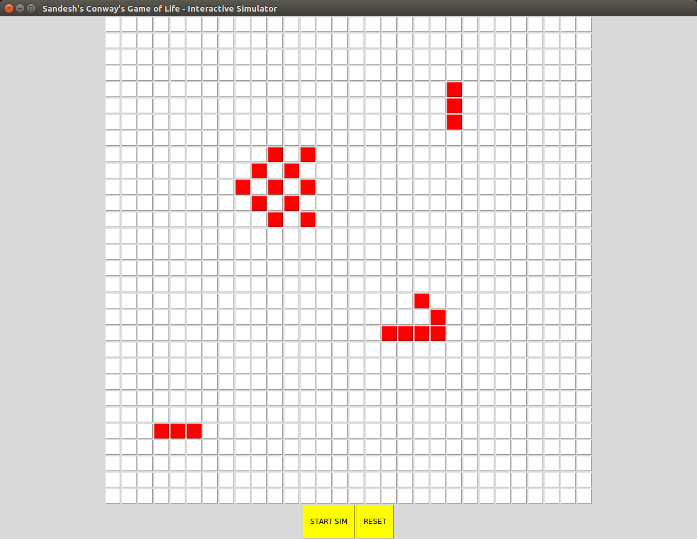

# conwaysgameoflife
Interactive GUI for Conway's Game of Life
Simple and Fun Side Project

Used Python's Tkinter Framework to create an interactive GUI for Conway's Game of Life

To run:
- Go to the folder with the python files game_gui.py and conway.py

RUN:

`chmod +x game_gui.py` 

`python game_gui.py`

-- 

Enter the graphic size (number of squares per side)
Enter the simulation rate 

The GUI should appear and just click on the squares you want to be alive to start the simulation. Once you are ready, just click the start simulation button. 

When done with the simulation and you want to start with a new set of initial conditions, then click the reset button and all the cells should clear up and the pixels should be clickable again. 

To start the simulation with a different number of pixels, just close the window and start again.

Pictures:

